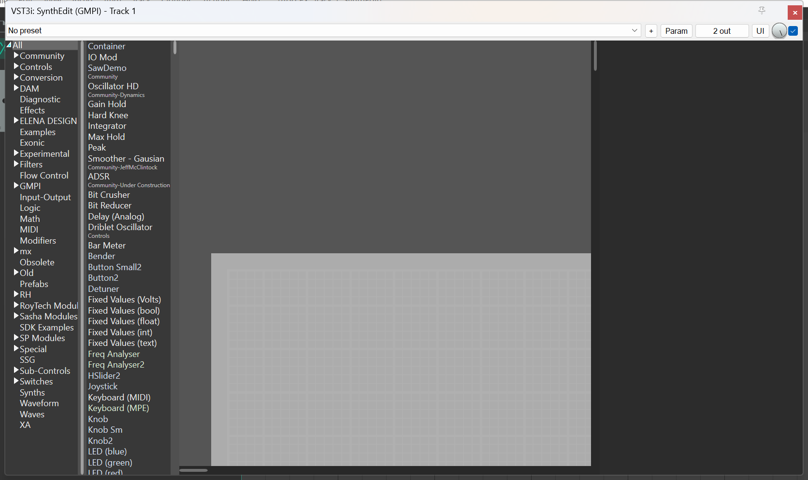
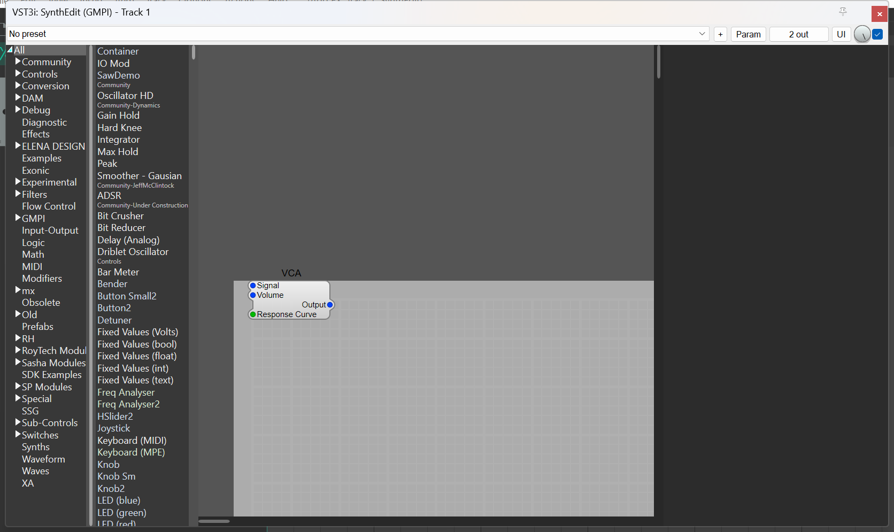

# State of the prototype — TIDE in a DAW, 2026-08-06

BACKLOG **P2**. Observation only. Nothing in `SE16`, `SynthEditLib` or the build
tree was modified to produce this document, and no bug found here was fixed.

Everything below was *seen*, not inferred, unless a paragraph says
"**Inferred**" — those are reasoned from source and are marked so a later run
knows which claims still need proving.

> **Names in this document are pre-N1a and are deliberately left as they were
> seen.** The rename landed 2026-08-22; today the same artifacts are
> `TIDE-Rack.gmpi`, `TIDE-Rack.so` and `TIDE-Rack.vst3` (`TIDE_Rack_VST3.vst3`
> on Linux until [#271](https://github.com/JeffMcClintock/TideSynth/issues/271)
> is fixed), with CMake targets `TIDE_Rack`, `TIDE_Rack_VST3`,
> `TIDE_Rack_STANDALONE` and PDBs named after those targets. Rewriting the
> observations below would falsify what was measured — see **N1b**.

## How it was observed

| | |
|---|---|
| Host | REAPER 7.78/x64 (evaluation licence), **portable copy** in a scratch dir |
| Plugin | `TIDE_VST3.vst3` from `C:\SE\build-tide-p1\SynthEditSem\{Release,Debug}` — the tree P1 built ([building.md](building.md)) |
| Machine | Windows 11 Pro 26200, the same box P1 ran on |

REAPER was copied to a scratch directory (program files + `%APPDATA%\REAPER`
resource dir) so it ran as a *portable* install: its own `REAPER.ini`, its own
plug-in scan cache, its own `Scripts` folder. Nothing in the developer's REAPER
config was touched, and the developer's own installed
`C:\Program Files\Common Files\VST3\TIDE_VST3.vst3` was left alone. The portable
copy's `vstpath64` was pointed at **only** the P1 build folder, so the scan had
exactly one plug-in to find.

Instantiation was done from `Scripts/__startup.lua` (REAPER runs that file
automatically at startup) rather than by clicking, so the run is repeatable:

```lua
reaper.InsertTrackAtIndex(0, false)
local tr  = reaper.GetTrack(0, 0)
local idx = reaper.TrackFX_AddByName(tr, "TIDE_VST3.vst3", false, -1)
reaper.TrackFX_Show(tr, idx, 3)   -- float the editor
```

Five REAPER launches were made in total (details in the JOURNAL entry).

---

## 1. It loads, and the editor opens

The VST3 scanned, instantiated and opened its editor with no error dialog and
no visible delay. This is the headline: **the prototype genuinely works as a
plugin in a real DAW today.**



The Debug build looks the same plus one `VCA` module, which `TideApp::OpenView`
adds under `#ifdef _DEBUG` (`SE16/SynthEditSem/TideApp.cpp:66-72`) — it is not a
document that was loaded from anywhere:



---

## 2. Resizing the editor window crashes the host — reproducible

**The most serious finding.** Sending the floating editor window a resize kills
REAPER instantly, taking the whole host process with it.

Repro: load TIDE on a track, float its editor, then change the editor window's
size (`MoveWindow` from outside, or by dragging its edge). Windows Error
Reporting, `Application Error` event 1000:

```
Faulting application name: reaper.exe, version: 7.7.8.0
Faulting module name: TIDE_VST3.vst3, version: 0.0.0.0
Exception code: 0xc0000005          <- access violation
Fault offset:   0x0000000000044d8c  <- Release build
```

and 3–5 seconds later a second fault at the same offset with `0xc000041d`
(unhandled exception during a user callback — i.e. it is dying inside a window
procedure, not on the audio thread).

Observed 3 times out of 3 attempts:

| Run | Build | Time | Exception | Fault RVA |
|---|---|---|---|---|
| 1 | Release | 16:41:39 | `0xc0000005` | `0x44d8c` |
| 4 | Release | 16:50:36 | `0xc0000005` | `0x44d8c` |
| 5 | Debug   | 16:52:21 | `0xc0000005` | `0x184ed9` |

Controls that rule out coincidence:

- Run 4 sat **idle for 2.5 minutes** with the editor open, polled every 5 s,
  `Responding=True` throughout. It died 1 second after the resize call.
- Taking a screenshot and calling `SetForegroundWindow` on the same window
  did *not* crash it (run 1 survived that at 16:39 and lived another 2 minutes).
- The same RVA in both Release runs; a different but equally stable RVA in the
  Debug build.

Note the window **did not actually change size** — `GetWindowRect` returned
`1672x995` both before and after — so the crash happens while *handling* the
size-change message, before any new size is adopted.

Minidumps were captured by Windows (this machine has LocalDumps enabled), ~37 MB
each:

```
%LOCALAPPDATA%\CrashDumps\reaper.exe.42964.dmp   (Release, 16:50:39)
%LOCALAPPDATA%\CrashDumps\reaper.exe.44464.dmp   (Debug,   16:52:25)
```

They are worth opening before they are cleaned up. **The Release configuration
produces no PDB** (only `Debug/TIDE_VST3.pdb` exists in the build tree), so the
`0x44d8c` offset cannot be symbolised as-is — use the Debug dump, whose PDB does
exist, or add `/DEBUG` to the Release link.

Filed as **P4**. **Diagnosed 2026-08-07** — root cause, symbolised stack and the
`cdb` recipe are in [p4-resize-crash.md](p4-resize-crash.md). It is a
time-of-check/time-of-use bug in `gmpi_ui`'s `DrawingFrame::reSize`, which
explains the "did not actually change size" observation below: the crash happens
inside `SetWindowPos`, before any new size is adopted.

---

## 3. The plugin does not identify itself as TIDE

REAPER lists it, and titles its window, as **"VST3i: SynthEdit (GMPI)"**.
"TIDE" appears nowhere in the host UI — only in the filename.

```
fxname = VST3i: SynthEdit (GMPI)
```

Consequently `TrackFX_AddByName(tr, "TIDE_VST3", ...)` returns **-1**; only the
filename `"TIDE_VST3.vst3"` matches. A user searching their FX browser for
"TIDE" will not find it. Filed as **P5**.

`TideApp::getVendor4charCode()` returns `"TIDE"`, so the vendor code is right;
it is the plug-in *name* and vendor string in the VST3 wrapper that still say
SynthEdit.

---

## 4. Zero host-automatable parameters

The three parameters REAPER reports are REAPER's own wrapper parameters, not the
plugin's:

```
numparams = 3
  param[0] Bypass = 0.0 (normal)
  param[1] Wet    = 1.0 (100)
  param[2] Delta  = 0.0 (normal)
```

A stock VST3 with no exported parameters looks exactly like this in REAPER. So
the patch currently surfaces nothing to the host — no automation, no
host-side control. This is the concrete state of design note 4 in
[design-notes.md](design-notes.md) and of BACKLOG **V2**; no new item filed.

---

## 5. The module list comes from the developer's machine, not from the bundle

The module browser is fully populated — hundreds of modules across the
developer's third-party collection (`Community`, `DAM`, `ELENA DESIGN`,
`Exonic`, `mx`, `RoyTech Modules`, `Sasha Modules`, `SP Modules`, `SSG`, `XA`…).
None of that ships inside `TIDE_VST3.vst3`.

Where it came from, established by elimination:

- `TideApp::InitInstance` sets `BundleInfo::semFolder = GetHomeDir() + L"modules\\"`
  (`TideApp.cpp:109`). `GetHomeDir()` is the folder holding the loaded binary
  (`SynthEdit2/Application.cpp:203`, via `GetModuleFileNameW`), i.e.
  `C:\SE\build-tide-p1\SynthEditSem\Release`.
- Then `LoadOrScanModuleData()` → `LoadModuleData()`, which reads
  `getSettingsFolder() / "SynthEdit" / SemCacheName()`
  (`SynthEdit2/ModuleFactory_Editor.cpp:1178`). On Windows `getSettingsFolder()`
  is `CSIDL_COMMON_APPDATA` (`SynthEditLib/modules/se_sdk3_hosting/BundleInfo.cpp:166`)
  — **`C:\ProgramData`**.
- `C:\ProgramData\SynthEdit\Plugin-Cache-16.xml` exists on this machine
  (1,062,235 bytes, mtime 2026-08-06 11:30:34 — written by the installed
  SynthEdit app, hours before this test). Its mtime was **unchanged** after five
  TIDE loads, so TIDE read it and did not rewrite it.

So on this machine TIDE works only because SynthEdit is installed beside it.
This is worse than "it scans a folder": it shares a **machine-wide** cache file
with the commercial app, under a name that does not distinguish the two
(`isSemFolderOverridden` is false, so `SemCacheName()` does not add the
per-folder hash suffix — `ModuleFactory_Editor.cpp:175-191`).

**Inferred**, not observed — the cache-miss path, which is what any real TIDE
user gets:

1. `LoadModuleData()` fails → `RefreshModuleData(true, false, true)` scans.
2. It scans `getSettingString(L"ModulePath")`, and `getSettingString` returns
   `BundleInfo::getUserDocumentFolder()` for *every* key
   (`Application.cpp:139-143`) — i.e. it recursively scans the user's entire
   **Documents** folder for `.sem`/`.gmpi`, plus `<Documents>_mac`
   (`Application.cpp:510-519`). On this machine Documents is OneDrive-redirected.
3. Then `StoreModuleData()` **writes** `C:\ProgramData\SynthEdit\Plugin-Cache-16.xml`
   — the installed SynthEdit's own cache.

Also note `GetHomeDir()` returns a path with **no trailing separator**
(`parent_path()`), so `GetHomeDir() + L"modules\\"` composes
`...\SynthEditSem\Releasemodules\`, not `...\Release\modules\`. Both are absent
here so it made no observable difference, but the concatenation is wrong.

This is evidence for **S1** and **S2**, whose scope already covers it. No new
item filed, but S2's audit should start from the four call sites above rather
than from a grep.

---

## 6. The one-view UX is not there yet

Measured against the layout in [design-notes.md](design-notes.md):

| design-notes says | what is actually there |
|---|---|
| Breadcrumb bar across the top | **absent.** The only strip above the view is REAPER's own preset/param bar. No navigation affordance at all. |
| Modules pane, collapsible | present — but it is SynthEdit's two-column browser (category tree + module list), always open, no collapse control visible |
| Properties pane on the right | **absent.** `TideApp::OpenPropertiesBrowser` exists but nothing on screen corresponds to it. |
| Structure view fills the middle | it does not — see below |

The document canvas (light grey with the grid) starts around x=437, y=525 inside
a 1672x995 window whose content area begins at roughly x=370, y=85. Everything
above and left of that is empty dark grey outside the document. The Debug
build's injected `VCA` sits at the canvas top-left corner, confirming that is
the document origin rather than a scroll offset in the content. There is also a
~440 px dead strip down the right-hand side, and a ~20 px sliver at the far left
where a fragment of another element shows through.

Filed as **U1**.

---

## What was deliberately not done

- **No MIDI or audio was played through it.** The v0.1 acceptance test (drop in
  an oscillator, wire it up, play it from the host, save and reload) is BACKLOG
  **V1** and needs the editor to survive interaction first — see P4.
- **No clicking inside the view.** Every interaction beyond the resize test was
  read-only, because P2 is an observation item.
- **The cache-miss path was not forced.** Renaming
  `C:\ProgramData\SynthEdit\Plugin-Cache-16.xml` would have made TIDE rescan and
  then overwrite the developer's installed SynthEdit cache. Out of scope for an
  observe-only item; whoever takes S2 should do it on a machine without SynthEdit
  installed, or with the file backed up.
- **No other host was tried.** Ableton, Bitwig, Steinberg and PreSonus products
  are installed on this box. REAPER was chosen because it can be run portable and
  driven from a script.

## Items filed from this session

| ID | Item |
|---|---|
| P4 | Editor window resize crashes the host (section 2) |
| P5 | Plugin identifies itself as "SynthEdit (GMPI)" (section 3) |
| U1 | One-view UX gaps: no breadcrumb, no properties pane, canvas offset (section 6) |
