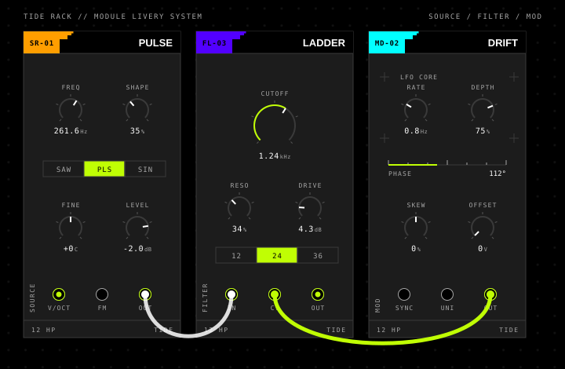
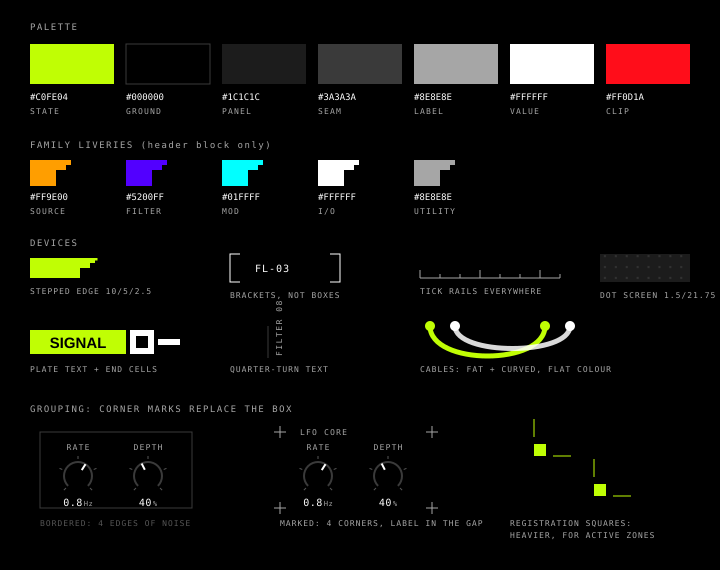
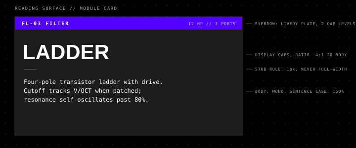
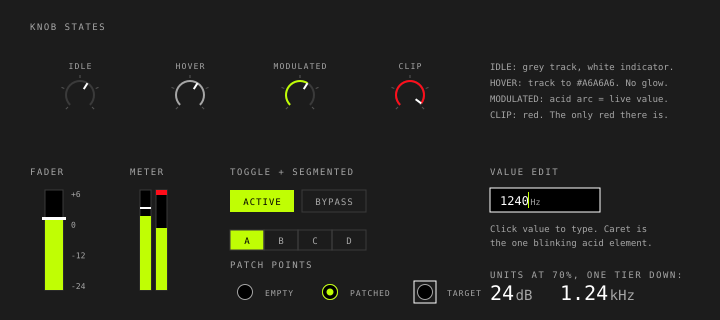

# UI design language

*Written 2026-08-18. Status: **proposal** — nothing in the renderer implements
this yet. It exists so that when UI work starts, the look is a decision rather
than an accident, per PLAN constraint 8 ("No user skins — TIDE ships its
default appearance"). If adopted, the adoption belongs in
[decisions.md](decisions.md).*

TIDE Rack needs exactly one look, shipped in the binary, drawn in code. This
document defines it: a synthesis of the design language of Bungie's
**Marathon** (2026) — both the in-game world and its brand system — and the
lineage behind it, chiefly **The Designers Republic's** work on WipEout.
Research notes and sources are at the end.

## Why this language

Three reasons, in order of importance:

1. **It is a 2D language.** Marathon's style ("graphic realism", Bungie's own
   term) is flat fills, 1px rules, mono caps and one violent accent — no
   gradients-as-decoration, no bevels, no drop shadows, no blur. Every device
   in it can be drawn with plain rects, lines and arcs in GMPI drawing code.
   No bitmap assets, which suits a plugin that ships its look in resources and
   writes nothing to disk. Read that as no image *files*: the panel material
   grain is computed into an offscreen bitmap at runtime, from a hash of the
   pixel coordinate, so it ships as code and costs no asset.

2. **Its worldview matches a modular.** The in-game rule, per its art
   director, is that *objects announce their use*: access panels are labelled,
   conduits carry hazard stripes, tape says ATTACH where you attach it. A rack
   of patchable modules wants exactly this ethic — every jack labelled, every
   knob labelled, no mystery glyphs.

3. **The TDR precedent solved our exact problem.** The Designers Republic's
   WipEout work gave each racing team its own livery — logo, colours, marks —
   inside one shared graphic system, carried through every trackside surface.
   Swap "teams" for "module families" and that is precisely how a rack full
   of modules stays scannable without per-module decoration.

One caution shapes everything below: Marathon's own shipped UI was widely
panned — players coined "fontslop" for it. The failure was not the palette or
geometry; it was **density** — poster design applied to a surface people read
continuously. A plugin is read continuously for hours. So this language takes
Marathon's geometry, colour and type, and rejects its density. The guardrails
in [§ Density rules](#density-rules) are as much a part of the language as the
palette is.

---

## The look in one image

Three modules in the language, showing the family-livery system, knobs as
arcs, tick rails, patch points, and the dot-screen rack ground:



*(All example modules, names and codes in these images are illustrative, not
the module set — that is [module-set.md](module-set.md)'s business.)*

---

## Palette

Eight colours run the whole UI. No ten-step grey ramps, no alpha-blended
tints beyond the two listed; if a mock wants a third grey between seam and
label, what it actually wants is hierarchy from size or case. Values are the ones verified from Marathon's own
brand system where applicable.

| Hex | Name | Job — and the *only* job |
|---|---|---|
| `#C0FE04` | **Acid** | Live state: the engaged value, the modulated arc, the patched connection, the caret. Never chrome, never headers, never decoration. |
| `#000000` | Ground | The rack background. True black, not charcoal. |
| `#1C1C1C` | Panel | Module faces. The only "raised" tone — flat, no bevel; the 1C-on-00 step *is* the depth cue. |
| `#3A3A3A` | Seam | 1px rules: panel borders, zone dividers, knob tracks, unfilled control frames. |
| `#A6A6A6` | Label | All static text: parameter names, port names, family tags. One step brighter than Marathon's `#8E8E8E`, which is a shade too dim for 8–10px caps read over long sessions (Jeff, 2026-08-18). |
| `#555555` | Marks | Minor ticks, stub rules, de-emphasised seams. **Never type** — `#A6A6A6` is the darkest ink text may take, on any ground. |
| `#FFFFFF` | Value | All live numbers and read-outs, plus indicator lines and module names. |
| `#FF0D1A` | Clip | Overload only. If red appears anywhere else, red stops meaning anything. |

Permitted transparencies: the dot screen (white at ~7% on the rack ground)
and a black scrim under text when it must sit on artwork (the one gradient
Marathon's site allows itself). Nothing else.

**The acid rule, stated once:** acid is a *state*, not a colour scheme. On a
panel of twelve controls, the two that are modulated show acid; the rest show
grey tracks and white indicators. That contrast is what makes the rack
readable at a glance — spend acid everywhere and the whole system collapses
into noise. It is also never used as text on light ground (illegible); it is
a fill with black text on it, or a mark on black.

### Family liveries

The TDR synthesis. Each module *family* gets a small flat colour block in the
panel header — with the stepped trailing edge, see below — plus a two-letter
code. Panels are otherwise identical in structure. The livery is identity,
never state: it appears in the header block and nowhere else on the panel.

| Family | Code | Livery |
|---|---|---|
| Sources (oscillators, noise) | `SR` | `#FF9E00` amber |
| Filters | `FL` | `#5200FF` violet |
| Modulators (LFOs, envelopes) | `MD` | `#01FFFF` cyan |
| I/O (host audio/MIDI) | `IO` | `#FFFFFF` white |
| Utilities (mix, logic, math) | `UT` | `#8E8E8E` grey |

(Assignments provisional; the point is the *system*: one hue per family,
small block, fixed position, never repeated as a state colour. Violet is
deliberately shared with nothing interactive.)

Marathon's in-game HUD uses the same trick in miniature — shield plates step
grey → green → blue → purple to encode *count* as hue. If TIDE ever needs an
ordinal indicator (oversampling tier, voice count), encode it as stepped hue
blocks in this spirit rather than as another number.



---

## Geometry

The constructional rules. These are strict, few, and they are what makes the
style cohere; every one is verified against Marathon's own vector work.

- **1px strokes, butt caps, everywhere.** On the brand site, 76 of 76 SVG
  linecaps are `butt`. Nothing is ever round-capped. 2px is the only emphasis
  width (active arcs, indicator lines). Snap 1px strokes to half-pixel
  boundaries or they go fuzzy.
- **Corner radius 0–2px.** Sharp enough to read as machined. No pills, no
  rounded cards.
- **Stepped edges, not diagonals.** Where a colour block ends on an angle, it
  steps down in halving squares — 10, then 5, then 2.5 — instead of a
  diagonal or a curve. This is the single most recognisable Marathon device
  and it costs three rects. Used on livery blocks and selection marks; used
  sparingly, it is the signature.
- **Plate text.** The inverted register, and Marathon's loudest in-game
  device: display caps knocked out on **a solid colour bar**, the bar
  hugging the text like hazard tape. Text colour is contrast-driven — black
  on the light plates (acid, cyan, amber, white), white on the dark ones
  (violet); the game runs both. A plate may end in one to three small
  **end cells** — an inverted square, a dash — after a short gap; that is
  the barcode note reduced to cells, never a full fake barcode. In TIDE the
  plate carries the module code (black on the livery block), active-state
  buttons, and the wordmark — and nothing else; it is the strongest emphasis
  the language has, so the density rules cap it.
- **Quarter-turn text.** Sideways labels — rotated exactly 90°, reading
  upward — everywhere a label is long and the space is narrow: the family
  tag up a panel's left edge, a version stamp on a rack rail. Constant in
  Marathon's environmental signage and standard practice on physical
  Eurorack faceplates, so the borrowed device lands on native ground. The
  quarter-turn is the *only* rotation in the language.
- **Grouping ladder — spend the least ink that works.** Four rungs, in
  order; only climb when the rung below genuinely fails:

  1. **Nothing.** Whitespace and a label. Most groups need no enclosure at
     all, and reaching straight for a box is the single commonest way these
     panels get noisy.
  2. **Corner marks.** Four small `+` crosshairs where the corners *would*
     be — 1px, butt-capped, ~6px arms, centred exactly on the corner point.
     The eye completes the rectangle from four marks, so you get the
     grouping for roughly a tenth of the ink a border costs, and content is
     free to overhang. This is the default for a logical group of controls.
     Marks take the seam colour (`#3A3A3A`) on a panel or Label grey on the
     rack; acid **only** if the whole zone is live.
  3. **Brackets.** Corner brackets or partial frames where a group needs
     stronger containment. A bracket's gap can carry its own label — the
     in-world release panels print `RELEASE` straight into the frame
     opening — and that is the preferred way to caption a bracketed group.
  4. **A closed box.** Reserved for things that genuinely *are* boxes:
     buttons, segmented switches, value-entry fields. A closed rectangle
     around a mere grouping is a defect, not a style choice.

- **Label a marked group in the gap.** The group's name sits on the top
  edge between the two upper marks, knocked out of the panel fill so the
  implied border appears to break for it — the same logic as a bracket
  caption. Label in the usual mono caps at Label ink; never larger than a
  parameter label, or the group starts outranking its own contents.
- **Registration squares** are the heavier cousin: a filled ~12px square
  with detached orthogonal ticks, in the livery or acid, marking a zone
  that is active or selected rather than merely grouped. One zone at a
  time — if two are marked, neither reads as special.
- **Pictograms are rect-built.** In-world signage constructs even the human
  figure from rectangles (flat fill, thin light outline); arrows are a
  triangle butted to a bar. TIDE iconography follows: compositions of rects
  plus the knob arc, one colour, solid fill or 1px outline, no freeform
  curves.
- **Stair clusters and hazard stripes stay in the world.** Two loud devices
  from the environment art do not board: the chaotic stepped-pixel clusters
  (licensed venues only, below) and diagonal hazard striping (nowhere — on a
  working surface the clean stepped edge replaces it, and diagonals stay
  banned).
- **Tick rails everywhere a value lives.** Scales drawn as literal measuring
  instruments — major/minor ticks, mono numerals. Function shown, not
  implied.
- **The dot screen.** One 1.5px-radius dot per 21.75px cell (the exact
  pattern Marathon ships) at low alpha — a tint for the rack ground, not a
  texture. It distinguishes "rack" from "panel" without a border.
- **Patch cables are fat and curved.** (Jeff, 2026-08-18 — overriding this
  doc's first draft, which wanted right-angle hairlines.) Cables are the
  user's own additions to the surface, not chrome, so they render as
  physical objects — Marathon's grounded-realism half: a shallow catenary
  droop at a constant ~5–6px width, ending in a **round plug head** over
  the jack. The flatness rules still apply: one solid colour per cable, no
  gradient, no highlight, no shadow, no taper. Acid for the cable being
  dragged or carrying the selected/modulated signal; white/grey otherwise.
  Cables carry the only *freeform* curve in the language — no other element
  gets an arbitrary path.
- **The round forms are the signal path.** Curvature is not decoration here;
  it marks where signal physically travels. Exactly four things are round,
  and they are the whole chain: the **knob arc** (a value sweep), the
  **jack ring**, its **concentric core** when patched, and the **cable**
  with its plug head. Everything structural — panels, plates, frames,
  ticks, meters, buttons — stays rectilinear. The split is legible at a
  glance: straight things are the instrument, round things are the sound
  going through it.

**Banned outright:** gradients as decoration, drop shadows, blur, glow,
bevels, blend modes, skew, rotation at any angle other than the quarter-turn,
round linecaps, textures other than the dot screen and the panel material
grain. If a mock needs one of those to work, the mock is wrong.

**The line between material and decoration** (Jeff, 2026-08-19, on building
`SE TiDE:Panel`). "Flat" here means *not modelled* — no bevel, no drop shadow,
no glow, nothing pretending the surface has depth. It does **not** mean bare.
A panel may carry a very subtle grain and a very shallow gradient, enough to
read as flat plastic or brushed metal rather than as a filled rectangle. The
test is whether you notice it: material is felt and not seen, so if a viewer
can point at the gradient or resolve individual noise pixels, it has stopped
being material and become the decoration this list bans. Everything else above
stands — a *shallow* gradient across a panel face is material; a gradient used
to draw the eye, mark state or fake a light source is still banned.

---

## Type

Marathon's system is five families deep (Shapiro Wide, KH Interference,
Fraktion Mono, IvyPresto, TT Interphases). That is the part that earned the
"fontslop" jeers, and TIDE takes none of it literally — the *lesson* is the
huge display-to-data size cliff and the mono-caps discipline, executed with
exactly **two faces**:

| Role | Face | Licence |
|---|---|---|
| Display (module names, the TIDE wordmark) | **Archivo Black** | OFL — embeddable |
| Everything else (labels, values, ports, menus) | **IBM Plex Mono** (Regular + Medium) | OFL — embeddable |

Both are free, embeddable in the plugin's resources, and cover the roles
Shapiro Wide 65 and PP Fraktion Mono play in Marathon. (JetBrains Mono is an
acceptable substitute for Plex Mono; Anton for Archivo Black. Decide once,
before the first widget is drawn.)

Rules:

- **Two sizes per zone.** A zone (one module's control group, one dialog) may
  use exactly two: label size and value size. The full UI scale is: module
  name 13–15px display caps; values 10–11px mono; labels 8–9px mono caps.
- **Labels: mono caps, grey, wide-tracked** (+8–12% letter-spacing — the site
  default is 0.1em). **Values: mono, white, tabular.** This two-tone split
  *is* the information hierarchy; it needs no boxes, no bold, no colour.
- **The size cliff is the style.** Marathon jumps from 141px display type
  straight down to 15px data with almost nothing between. In a plugin that
  means: module name big, everything else small, no middle sizes drifting in.
- **Numerals are data.** Frequencies, dB, note names always in the mono face,
  always with units.
- **The unit is a third tier, not part of the number.** A read-out is two
  typographic ranks in one line: the **numeral** at full size in the Value
  ink (`#FFFFFF`), then the **unit** at **70% of the numeral's size** in the
  Label ink (`#A6A6A6`), separated by a hair space rather than a full one.
  The numeral is the thing that changes, that you drag, that you click to
  type into — so it takes the size and the bright ink, and the unit recedes
  to a caption that never competes with it. Where the numeral is *not*
  editable (a fixed rating, a static spec), drop the numeral to the Label
  ink too and keep the 70% step; the size relationship is what carries the
  meaning, the ink only marks what is live. (Jeff, 2026-08-18.)

  ```
  24 dB        numeral 20px #FFFFFF · unit 14px #A6A6A6
  1.24 kHz     numeral 10px #FFFFFF · unit 7px  #A6A6A6
  ```

- **Units take SI casing, not the caps register.** `dB`, `kHz`, `ms`, `Hz`,
  `V`, `st` — because a unit symbol is case-significant (`mS` and `ms` are
  not the same thing) and now that units are their own tier they are no
  longer bound by the all-caps label rule. This is the one place lowercase
  is correct outside prose. `%` and `°` set tight against the numeral with
  no space.
- **A caret edits the numeral, never the unit.** In a value field the acid
  caret sits after the last digit and before the unit.
- **Reading surfaces get the card stack.** Marathon's in-game item cards
  build hierarchy from type contrast alone — no boxes: a small **eyebrow
  plate** (semantically coloured — rarity in the game, family livery in
  TIDE — carrying up to two levels of small caps), then the **display
  headline** at a ≥3:1 size ratio to the body, a **stub rule** (1px, ~25px
  long, never full-width), then **mono body copy in sentence case** at
  ~150% leading. Face change, size ratio and case change do all the work.
  This is the template for every surface that is *read* rather than
  operated: the module inspector/tooltip, dialogs, the about pane, the
  empty-rack state.
- **Case is register.** Caps = identity and data (names, labels, values);
  sentence case = prose (descriptions, dialog copy). The in-game cards
  switch case exactly at that line, and it is what keeps multi-line copy
  readable where all-caps would clot.
- **No serifs.** Everything in Marathon's working UI is sans or mono. What
  reads serif-ish in captures is two legibility details carried by those
  faces — crossbars on capital `I` and the footed `1` (see `SEASON 1` and
  the `01` signage in the reference captures — *Marathon menu badges and
  chips* and *Marathon pictogram signage*). Conveniently,
  IBM Plex Mono's crossbarred `I` reproduces the detail for free. (Press
  reporting lists IvyPresto, a serif, among the game's licensed faces; it
  does not appear in the working-UI register and TIDE takes nothing from
  it.)



---

## Widgets



- **Knob = open 270° arc.** Track: 2px seam-grey arc, five square ticks
  outside it. Value: 2px white indicator line, radial, butt-capped. No body,
  no cap, no shading — the knob is a reading, not an object. The acid arc
  from minimum to current appears **only** when the parameter is modulated or
  being dragged; at rest, arcs are grey. Hover lightens the track to
  `#A6A6A6` — no glow.
- **Fader/meter = filled rect in a 1px frame.** Fill acid, cap line white,
  peak-hold a 2px white tick, clip a red block at the top. Nothing rounded.
- **Buttons and segmented switches:** 1px seam frame, mono caps grey when
  off; flat acid fill with black text when on. On/off is fill/no-fill —
  never two tints of the same colour.
- **Patch points:** 7–8px circle, 1px grey ring; patched = acid ring with a
  **concentric acid core** (r≈3.5); drag target = square bracket frame
  around the ring. The core is round, never square — a square inside a
  circle reads as a misregistered part rather than a seated plug (Jeff,
  2026-08-18). Connected state still survives colour-blindness and 1×
  rendering, because the cue is filled-vs-empty, not hue.
- **Value edit:** click a value, get a 1px white-framed field; the caret is
  the one blinking acid element on screen.
- **Badges and chips.** A count badge is plate text in miniature — a small
  acid square with a black mono numeral, sitting after a heading (the
  in-game menu's `CODEX 13` pattern). A status chip is a light grey plate,
  black mono caps, with a leading livery-coloured icon cell. These are the
  only two floating-notification shapes the UI gets.
- **Every control is labelled.** The Marathon in-game ethic, applied
  literally: if a jack or knob would need a tooltip to identify, it is
  mislabelled. Abbreviate (`FREQ`, `RESO`, `V/OCT`) but never omit.
- **Module header anatomy:** livery plate at left with the module code
  knocked out in black, stepped trailing edge, module name in white display
  caps at right; the family name reads quarter-turned up the panel's left
  edge. Header identity lives in exactly these three marks.

Motion: near-none. State changes snap or cross in under ~80ms; meters and
modulation arcs move because signals move. No eased flourishes, no springs,
nothing decorative in motion — the in-game glitch/interference styling stays
in the game.

## Density rules

The anti-fontslop guardrails. These outrank aesthetic preference:

1. Two type *ranks* per control zone — label and value — and reading
   surfaces get the card stack (eyebrow / headline / body), nothing more.
   The unit's 70% step does not count as a third rank: it is the value rank
   rendered small, bound to its numeral, and it may never appear on its own
   or carry information the numeral does not. Hierarchy comes from size
   ratio, face and case — never from adding a genuine fourth level. (Worth
   restating; this is the rule Marathon's own UI breaks most.)
2. Acid on live state only; red on clip only; liveries in headers only.
3. One *figurative* texture (the dot screen), on the rack ground only. Panels
   are flat in the sense of unmodelled — no bevel, shadow or glow — but may
   carry a material grain and a shallow gradient so they read as plastic or
   metal. Material is felt, not seen: if you can resolve the noise or point at
   the gradient, it has become decoration and rule 6 applies.
4. Stepped edges and plate text are header and state devices — livery
   blocks, module codes, active buttons, the wordmark — never body
   decoration. One plate register per surface; a panel of competing plates
   is exactly how the game's own UI drowned.
5. No decorative pseudo-data: no fake barcodes, coordinates, serial numbers
   or glitch overlays on working surfaces. Marathon's environment art earns
   these as *world-building*; a control panel read for eight hours does not.
   (The about pane is the one licensed exception — see below.)
6. When in doubt, delete. The language survives subtraction; it dies of
   addition.

## Where the flavour is allowed out

Three licensed venues for the loud end of the language, so the working
surface never needs it:

- **The wordmark & about pane** ([about-pane.md](about-pane.md)): supertype
  display, the full livery row, stair-step pixel clusters, and the one place
  pseudo-data flavour text is welcome (version, build hash, licence — real
  data styled as manifest). Loud compositions here run **monochrome**: one
  hue plus black and white, the register of the game's green
  full-screen graphics.
- **Empty rack state:** a brackets-and-mono invitation (`[ ADD MODULE ]`),
  centred on the dot screen — the "terminal" note inherited from Marathon
  1994's DOS-style terminals, and the natural first-run moment.
- **The website** ([tidesynth.com](https://tidesynth.com)): marketing can run
  the full Marathon-adjacent register — supertype, colour statements, stepped
  graphics — because it is scanned once, not read for hours. The site and
  plugin share the palette and faces so the identity holds across both.

---

## Research notes (what this synthesises)

**Marathon (2026), brand system — verified 2026-08-18** by inspecting
marathonthegame.com's live stylesheets and SVG: palette (`#C0FE04` acid, 199
uses; `#000`/`#1C1C1C`/`#fff`; `#5200FF` violet; greys `#696969`/`#555`),
faces (customised Shapiro Wide 65, PP Fraktion Mono, KH Interference, TT
Interphases Pro), type tokens (141/57/39/24/18/15/14/12px; 0.1em tracking;
135% leading), 1px butt-capped strokes throughout, 2–3px radii, the
21.75px/1.5px dot pattern, stepped-square edges, bracket framing.

**Marathon (2026), in-game** — eight captures supplied by Jeff are this
doc's primary in-game reference (2026-08-18). They live **outside the repo**,
in his GUI reference library at
`C:\Users\jef\OneDrive\SynthEdit\modular-gui-ideas`, filed under the
`Marathon *.png` prefix — deliberately not committed, since they are
third-party game captures and reference material rather than project
content. The eight, by what each one settles: *CONSCIOUSNESS plate text*
(plate text, end cells, pixel clusters, sideways signage), *menu badges and
chips*, *pictogram signage* (rect-built figures, bar-and-triangle arrows),
*RELEASE brackets and sideways text* (labels printed into bracket gaps),
*item card type hierarchy* (the eyebrow/headline/body stack), *HUD corner
crosshair* and *registration squares* (the two grouping markers), and
*crosshair reticle*. Everything else below is reported via
secondary sources: "graphic realism"
— simplified graphic language + realistic proportion + implied function;
functional clarity ("objects should inform you of their use" — hazard
stripes, ATTACH/SEAL labels); saturated colour blocking against grounded
environments; condensed industrial display type with mono/coordinate
secondary type; **inverted plate labels** (black display caps on solid
colour bars with small end cells) and **vertical/sideways signage text**,
both constant across the in-game environment graphics; item cards built
from type contrast alone — rarity-coloured eyebrow bar, display headline at
a ~4:1 ratio over sentence-case mono body, stub-rule divider, no boxes;
rect-built pictograms and bar-and-triangle arrows in signage; bracket
frames captioned in their own gaps (`RELEASE`); count badges and status
chips in the menus; crosshair registration marks standing in for section
borders in the HUD (a `+` at the group's corner, with the rest of the frame
left to the eye) and heavier filled-square corner marks with detached ticks
in the full-screen graphics; chaotic stair-step pixel clusters, diagonal hazard
striping and single-hue monochrome compositions in the environment/
narrative register (deliberately not imported to working surfaces);
shield plates encoding count as hue steps
(grey/green/blue/purple); rarity ramp with red as the exclusive tier; and the
"fontslop" UI reception that motivates the density rules.

**Lineage:** The Designers Republic's WipEout graphics (per-team liveries
inside one system — the direct model for family liveries; named by Marathon's
art director Joseph Cross as an influence, alongside Otomo, Ghost in the
Shell, Aeon Flux, Mirror's Edge and the 1994 Marathon's terminal screens).
Mirror's Edge is the restraint model: one accent, used only to signal.

Sources: [Bungie's site](https://marathonthegame.com) (primary);
[80.lv interview with Joseph Cross](https://80.lv/articles/marathon-art-director-shares-the-team-s-creative-influences);
[Creative Bloq interview](https://www.creativebloq.com/3d/video-game-design/bungies-art-director-explains-marathons-controversial-art-style);
[Fonts In Use: Marathon](https://fontsinuse.com/uses/67879/marathon-2026-video-game-1);
[Brace.design analysis](https://www.brace.design/single-post/bungie-s-marathon-an-eye-for-design);
[Joseph Kerr on the UI's hierarchy failures](https://josephkerrdesign.com/bungies-overdesigned-uis-what-marathon-gets-wrong/);
[GamesRadar on the "fontslop" reception](https://www.gamesradar.com/games/fps/the-first-ever-fontslop-game-marathon-players-are-already-sick-of-looking-at-the-upcoming-bungie-shooters-eye-sore-ui/);
[The Designers Republic × WipEout](https://www.thedesignersrepublic.com/project/wipeout).

The three images in this doc are generated —
[`docs/images/ui-language-*.svg`](images/) — and drawn entirely inside the
language's own rules (flat fills, 1px butt strokes, two faces, acid on state
only), so they double as a feasibility check: everything shown is plain
rects, lines and arcs.
