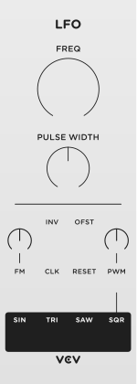
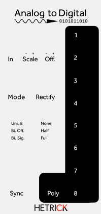
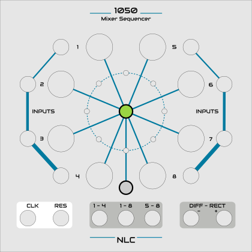

# Permissively-licensed VCV / Cardinal modules — code *and* artwork

Research, 2026-08-25 (macos, interactive, Jeff directing). Companion to
[vcv-fundamental.md](vcv-fundamental.md), which covers the GPL Fundamental
ports. **This document asks a different question: which modules could TIDE ship
without becoming GPL, artwork included.**

Nothing here is legal advice.

---

## 1. The finding that reframes the question: the adaptor's GPL is a CHOICE

`TIDE_VCV_FUNDAMENTAL=ON` produces a GPL binary today, and it is easy to read
that as "anything through the adaptor is GPL". **It is not.** Measured by
reading the fetched source rather than inferred:

- `SynthEdit_Rack_Adaptor/rack/rack.hpp` is **99 KB of Jeff McClintock's own
  code**, headed *"A MOCK of VCV Rack's plugin.hpp"* and
  `Copyright 2007-2026 Jeff McClintock`.
- The repo's own README: **"This repository contains no VCV Rack code and no
  VCV artwork."**
- `grep -rniE "copyright.*(vcv|andrew belt)"` across the adaptor returns
  **nothing** — the only VCV mentions are prose describing compatibility, plus
  one numeric constant (`23.7f`, the pixel size of Rack's `PJ301M.svg`), which
  is a measurement, not artwork.

So the adaptor is GPL-3.0-or-later **by election, not by inheritance.** The
README says so directly: *"That is deliberate. VCV Rack modules are typically
GPL-3.0-or-later, so a binary combining one with this adaptor is a combined
work..."* — the licence was chosen to match the modules it was written for.

**Jeff is the sole copyright holder, so he can relicense or dual-licence it.**
That is the whole unlock: pair a relicensed adaptor with a permissively-licensed
module and permissively-licensed panel art, and the result can ship under TIDE's
ISC terms. **That is a decision for Jeff and nobody else** — this document only
establishes that the option exists and what it would be worth.

---

## 2. The rule that governs everything below

**Code licence and artwork licence are separate, and the artwork is usually the
stricter of the two.** Cardinal, which has done this at scale and had to, states
it plainly, and the adaptor's README already quotes them:

> just because a plugin/module is open-source, it does not mean that it can be
> included in Cardinal. Many modules have very strict license terms on the use
> of its artwork, or the code can have a license not compatible with Cardinal.

The canonical trap, straight out of Cardinal's own table:

| pack | code | artwork |
|---|---|---|
| **AS** | **MIT** | **CC-BY-NC-ND-4.0** |
| **Mog** | **CC0-1.0** | `Mog/*` CC0 — but **`Mog/components/*` CC-BY-NC-4.0** |

Two more rules worth carrying:

- **"Used and distributed with permission" is not a licence you have.**
  Permission was granted to *that project*. AudibleInstruments, Befaco,
  E-Series and ArableInstruments/ParableInstruments are all in this category.
- **NC and ND are both disqualifying for TIDE**, and for different reasons. ND
  forbids sharing any modification — recolouring for a dark theme included. NC
  cannot be sublicensed under ISC, because ISC grants recipients commercial use.
  TIDE being free does not rescue an NC asset.

---

## 3. Candidates — permissive code AND permissive artwork

Sourced from Cardinal's `docs/LICENSES.md` (the curated bulk survey), then the
top entries **verified against each project's own primary source**. Cardinal's
table applies a pack's licence to `Pack/*` and carves out exceptions
individually, so "no artwork-specific licence" means the pack licence covers the
art — the AS and Mog rows above prove it lists a separate artwork line whenever
one exists.

### Tier A — CC0: public domain, code and artwork alike

The cleanest possible position. No attribution obligation, no share-alike, no
relicensing friction.

| pack | code | artwork | modules | verified |
|---|---|---|---|---|
| **HetrickCV** | **CC0-1.0** | **CC0-1.0** | ~70 | ✅ `LICENSE.txt` fetched — CC0 1.0 Universal, covers all works without distinguishing code from art |
| **Nonlinear Circuits** | **CC0-1.0** | **CC0-1.0** | 18 | ✅ `LICENSE.txt` fetched — CC0 1.0 Universal |
| **WSTD-Drums** | **CC0-1.0** | *(no separate row → CC0)* | — | Cardinal table only |
| **DrumKit** | *(see note)* | **CC0-1.0** | — | Cardinal table only; code licence not confirmed |

Font exceptions, all redistributable: HetrickCV and Nonlinear Circuits ship
`Audiowide-Regular.ttf` (OFL-1.1-RFN); DrumKit ships `NovaMono.ttf`
(OFL-1.1-RFN). OFL permits redistribution; **RFN** only forbids reusing the
font's *name* for a modified version.

**HetrickCV is the standout.** ~70 modules, CC0 throughout, and it is the same
author (Michael Hetrick) as Nonlinear Circuits — so one relationship covers ~88
modules. Its catalogue is also complementary rather than duplicative: a large
phasor/logic/chaos/utility set (Phasor Generator, Boolean Logic, Analog↔Digital,
Rungler, Waveshaper, Dust, Crackle) rather than another VCO/VCF/ADSR.

### Tier B — MIT / BSD, artwork under the same licence

Attribution required (keep the notice); otherwise unrestricted.

| pack | code | artwork | modules | verified |
|---|---|---|---|---|
| **CVfunk** | MIT | MIT — *"same license as source code"* | 43 | ✅ `plugin.json` `"license": "MIT"` |
| **DHE-Modules** | MIT | MIT — *"same license as source code"* | 28 | ✅ `plugin.json` `"license": "MIT"` |
| **Rackwindows** | MIT | MIT — *"same license as source code"* | — | Cardinal table |
| **ExpertSleepers Encoders** | MIT | MIT — *"same license as source code"* | — | Cardinal table |

Others with permissive code where Cardinal lists **no** separate artwork licence
(so the pack licence covers the art), unverified at source:

- **MIT** — 21kHz, Aaron Static, admiral, Biset, Hampton Harmonics,
  LifeFormModular, Mockba Modular, MSM, Starling Via
- **BSD-3-Clause** — 8Mode, Amalgamated Harmonics, Catro/Modulo, cf,
  Computerscare, JW-Modules, ML Modules, mscHack
- **WTFPL** — WhatTheRack (its `BoomButton/*` is CC-BY-3.0 — attribution)

### Tier C — permissive code, share-alike artwork

Usable, but the **art** is copyleft: derivatives of the panels must stay
CC-BY-SA-4.0 and be attributed. That does not touch TIDE's own code licence, but
it does mean a restyled panel is encumbered.

| pack | code | artwork |
|---|---|---|
| **Prism** | BSD-3-Clause | CC-BY-SA-4.0 |
| **BogaudioModules** | *(not permissive — GPL)* | CC-BY-SA-4.0 |
| **repelzen** | *(not confirmed)* | CC-BY-SA-4.0 |
| **AriaModules** | *(not confirmed)* | CC-BY-SA-4.0, with carve-outs — `Arcane/*` is CC-BY-NC-SA-3.0, and `signature/*` is custom: *"Removal required if modifying other files"* |

### Excluded, and why

| pack | reason |
|---|---|
| **VCV Fundamental** | GPL-3.0-or-later code; panels **CC-BY-NC-ND-4.0** and carrying VCV's logo and trademarked name |
| **AS** | MIT code but **CC-BY-NC-ND-4.0** artwork |
| **Mog** | CC0 overall but **`components/*` CC-BY-NC-4.0** |
| AnimatedCircuits, Befaco, Bidoo, dBiz, GrandeModular, ImpromptuModular, LyraeModules, MindMeld, Orbits, RebelTech, SurgeXT, unless_modules, ZZC | NC and/or ND artwork |
| AudibleInstruments, ArableInstruments/ParableInstruments, Befaco panels, E-Series | artwork "with permission" — granted to Cardinal, not to us |
| BaconPlugs/beeth | licence marked **"???"** in Cardinal's own table |

---

## 4. The engineering caveat, which is not a licensing one

`RackEditor.h:25-29`, verbatim:

> **WHAT THIS DOES NOT DO: draw the knob caps, jacks or screws.** Fundamental's
> panel SVGs already carry that artwork, so the editor draws only the moving
> part — an indicator line per knob. **Modules whose panels do NOT include the
> component art will look bare** until someone teaches this to render the
> component types themselves.

So a module can be perfectly licensed and still render as an empty faceplate.
Whether a given pack's panels bake in their own jacks and knob caps is a
**per-pack property that has to be looked at**, and it is the thing most likely
to turn a cheap port into an expensive one.

**Partially measured, and honestly inconclusive.** HetrickCV's `Crackle.svg` is
37 KB with 38 `<path>`, 9 `<circle>` and 0 `<text>` (text converted to paths) on
a 90×380 (6HP) panel — substantial art, not a bare rectangle. But the nine
circles are a nested decorative motif (each at `cx = -r`, all tangent to x=0),
**not** jack art, so this does not settle whether jacks and knob caps are drawn.
**One ported module answers it definitively**, and that is the cheapest next
step for any pack under consideration.

TIDE's own `TiDEknob` and `TiDE Patch Point In/Out` exist and are compiled in,
so the alternative — teaching `RackEditor` to draw TIDE's components at the
positions the module already reports — is a real option and would make panel
art *less* load-bearing across every pack at once.

---

## 4b. CORRECTION, same day: §4a's conclusion is withdrawn

**§4 and §4a are both built on a comment that says the opposite of the code, and
the conclusion they reach is wrong.** Recorded here rather than deleted, because
the measurements in §4a are sound and only the inference from them is not.

`RackEditor`'s render path is:

```
panel art -> drawModuleWidgets(-1) -> drawJacks() -> drawKnobs() -> drawLights()
```

**`drawJacks()` draws a five-ring VCV-style jack sized from the module's own
widget. `drawKnobs()` draws rim, body and pointer.** Both read
`layout.inputs` / `layout.outputs` / `layout.params`, which come from the
module's `ModuleWidget` and have **nothing to do with the panel SVG**.

So a labels-only panel is a normal working VCV panel. **HetrickCV, DHE and
CVfunk are not disadvantaged**, and "the only pack whose panels carry their
control art is the GPL one" is true and irrelevant.

The source of the error: `RackEditor.h:25-29` claims the editor draws no knob
caps, jacks or screws. That was accurate at the adaptor's initial commit
(`d4de897`) and superseded by `623f1f7` — *"Draw the jacks, VCV-style, sized
from the module's own widget"* — **the same day**. It was quoted as
authoritative here while the file it describes was open. Fixed in
[SynthEdit_Rack_Adaptor#2](https://github.com/JeffMcClintock/SynthEdit_Rack_Adaptor/pull/2).

**What the rendering DID surface, and it survives:** the packs differ in
authoring units. HetrickCV panels are 380-unit (Rack pixels); **CVfunk and DHE
are viewBox height 128.5 — millimetres.** `RackEditor` carries an explicit
75-vs-96-dpi correction for exactly that case, warning a mm panel "draws 28% too
large for the coordinates its own module places controls at". The mechanism
exists; nobody has verified it lands correctly. That is the real open risk for
those two packs, and it is now on **E23**.

**§5's order stands as originally written: HetrickCV first.**

## 4a. MEASURED 2026-08-25: rendered, and it inverts §5's order

§4 left the component-art question open and said one ported module would settle
it. **Rendering the panels settles most of it for a fraction of the cost**, and
the answer disqualifies the pack §5 recommends first.

**Two SVG-geometry screens were tried before this and BOTH were wrong.** Counting
circles by radius reported that Fundamental — the pack `RackEditor.h` says *does*
carry component art — had **zero** jacks; its jack holes are `r=5.0` in a 380-px
viewBox, under the threshold. Recalibrated, HetrickCV then scored **0 circles
across 12 panels** — because it converts every shape to `<path>`. **The circle
count was measuring authoring style, not content.** Only rendering answered it.

Method: `rsvg-convert -h 420 -b white`, two panels per pack, Fundamental as the
positive control.

| pack | draws its own knobs/jacks? | evidence |
|---|---|---|
| **Fundamental** *(control, GPL)* | **yes** — knob circles with indicator lines |  |
| **HetrickCV** | **no**, both samples — labels and leader lines on a blank faceplate |  |
| **Nonlinear Circuits** | **mixed, per-module** — `1050` is the best panel measured, `8BitCipher` draws none |  |
| **DHE-Modules** | no (`blossom`) — labels and rules | — |
| **CVfunk** | not evident (`Alloy`) — stylised dark panel | — |

**The uncomfortable conclusion: the only pack whose panels demonstrably carry
their control art is Fundamental, the GPL one.** Licensing and drawability point
at different packs, and no permissive pack is clean on both.

That makes **E23** — teaching `RackEditor` to draw TIDE's own `TiDEknob` and
`TiDE Patch Point In/Out` at the positions the module already reports — the
highest-leverage row of the set. It converts four packs from "looks broken" to
"usable" without touching a licence, and the adaptor already has the
coordinates.

**Still not verified:** no module has been ported. This is a prediction from the
panel art plus `RackEditor.h`'s own statement, not an observed TIDE render.

## 5. Recommendation

1. **HetrickCV first**, and treat it as the pilot. CC0 for both code and
   artwork removes every licensing question at once, ~70 modules is a real
   catalogue rather than a token, and the same author's Nonlinear Circuits (18
   more, also CC0) follows for free.
2. **Port one HetrickCV module before deciding anything else**, and look at it.
   That settles §4's open question, which is the only unquantified risk here.
3. **The adaptor's licence is the gating decision and it is Jeff's.** Everything
   above is worth nothing while the adaptor is GPL-3.0-or-later, and the adaptor
   is GPL by choice rather than obligation. A dual-licence — GPL when built with
   GPL modules, ISC when built with permissive ones — matches how the option
   already works (`OFF` means *completely absent*).
4. **Keep the licence data next to the build option.** If a permissive set does
   get bundled, its per-pack code and artwork licences and their notices belong
   in the repo, the way Cardinal keeps `LICENSES.md` — the obligation under MIT,
   BSD and CC-BY-SA is attribution, and attribution has to be shipped.

## Sources

- [Cardinal `docs/LICENSES.md`](https://github.com/DISTRHO/Cardinal/blob/main/docs/LICENSES.md) — the per-pack code and artwork table
- [HetrickCV `LICENSE.txt`](https://github.com/mhetrick/hetrickcv) — CC0-1.0, verified
- [Nonlinear Circuits `LICENSE.txt`](https://github.com/mhetrick/nonlinearcircuits) — CC0-1.0, verified
- [CVfunk `plugin.json`](https://github.com/codygeary/CVfunk-Modules) — MIT, verified
- [DHE-Modules `plugin.json`](https://github.com/dhemery/DHE-Modules) — MIT, verified
- `SynthEdit_Rack_Adaptor` `README.md`, `LICENSE`, `rack/rack.hpp`, `RackEditor.h` — read from the tree fetched by this build
